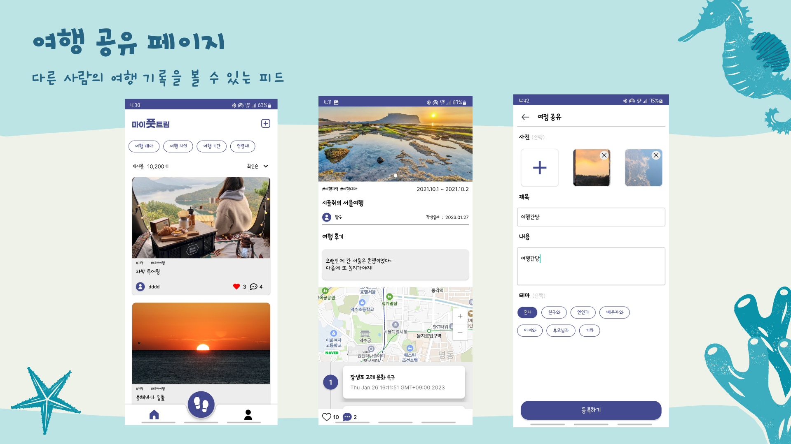
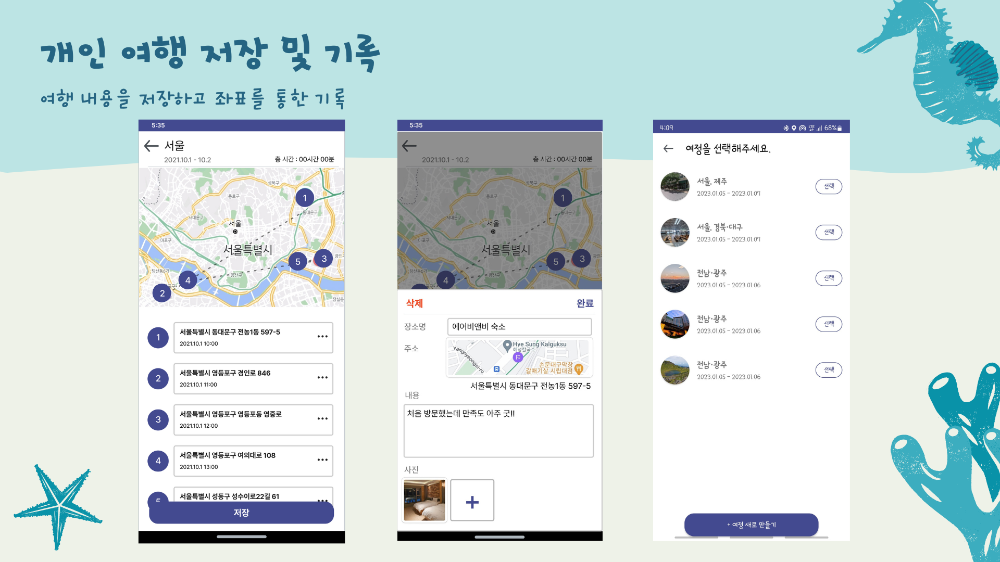
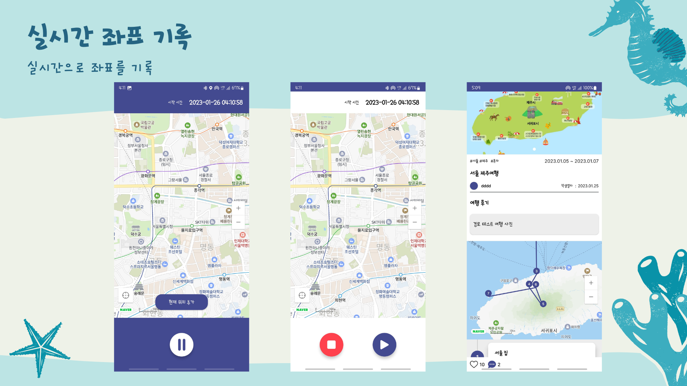
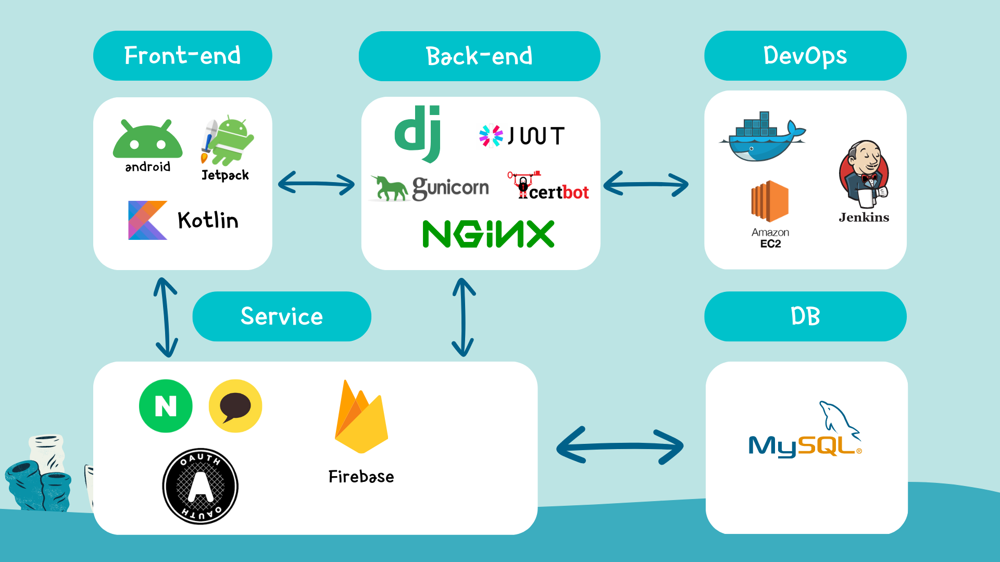
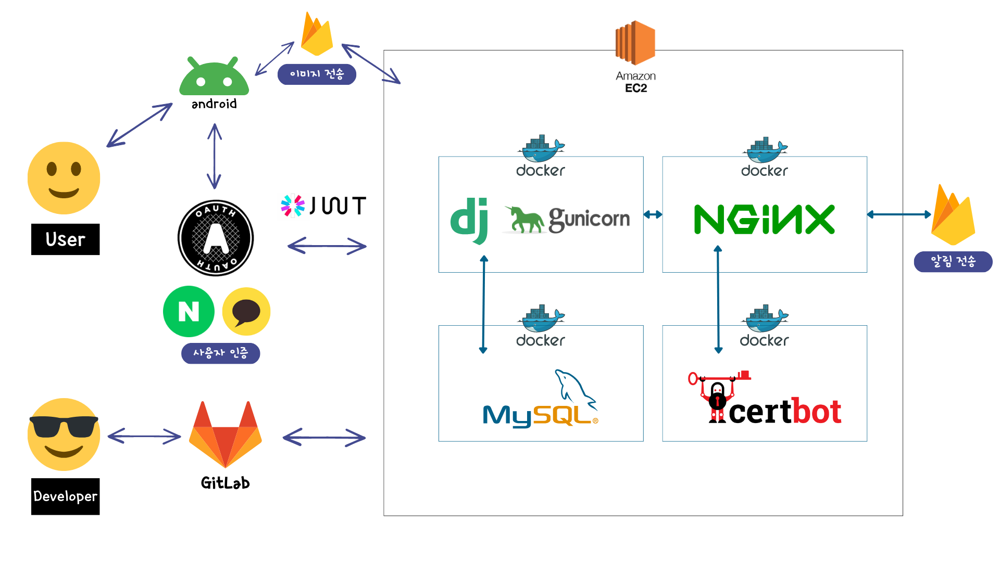
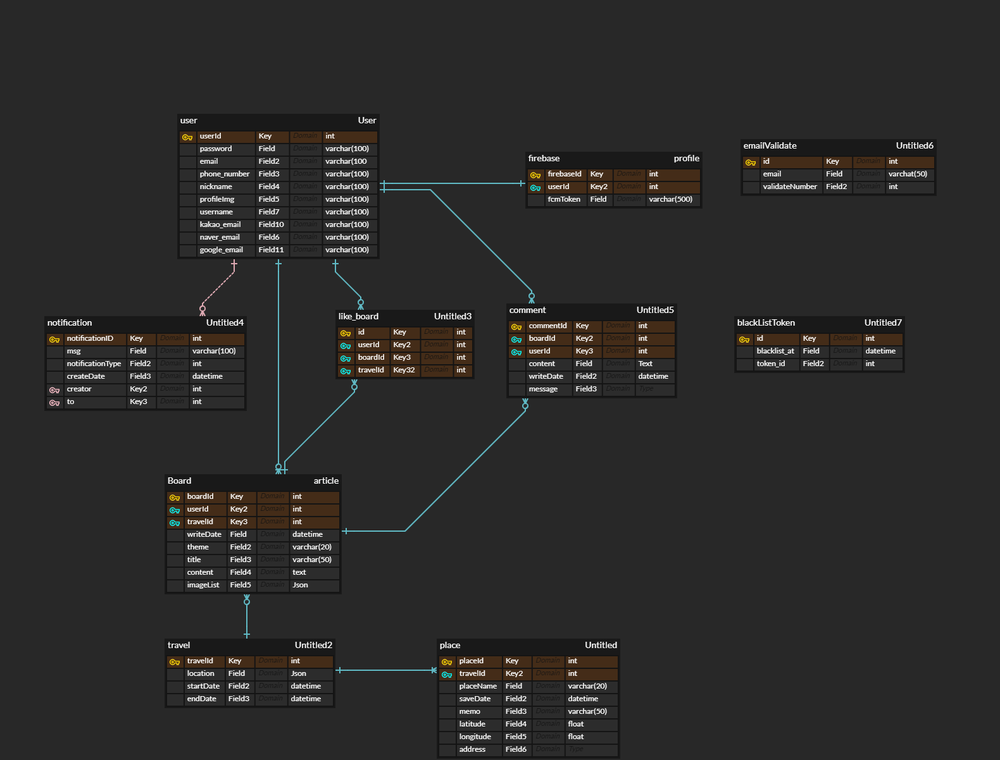
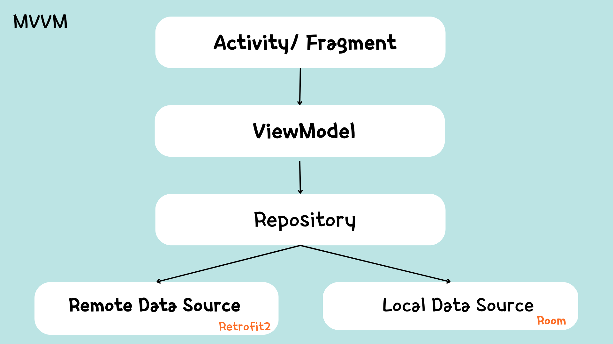
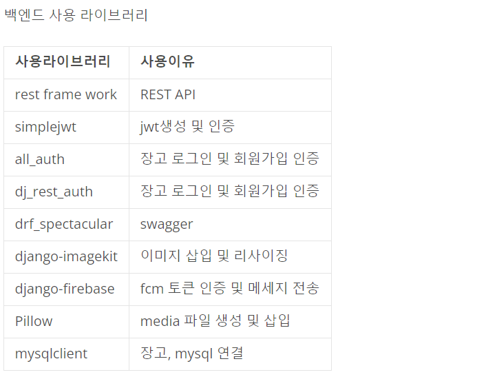
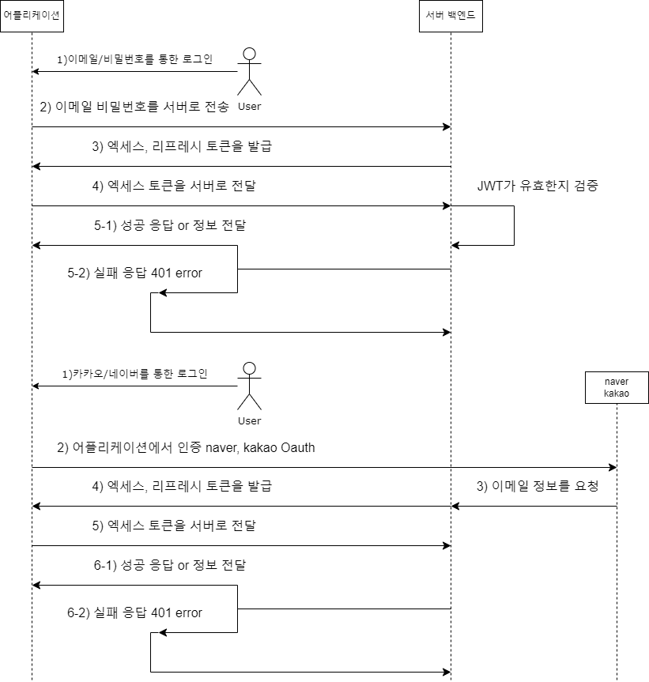

## :airplane: MyFootTrip(마이풋트립)

MyFootTrip 프로젝트는 Android 앱으로 제공되는 _여행 기록 및 커뮤니티 어플리케이션_ 입니다. 기획 의도는 여행 후기를 공유할 수 있는 플랫폼의 제공과 로직 및 디자인 모두 디테일 한 부분까지 고려하여 완성도 높은 앱의 개발입니다. 아이디어를 착안하게 된 서비스는 구글의 타임라인과 여행 계획 어플인 트리플입니다. 우리의 어플은 이러한 서비스들이 가지지 못한 위치 자동 기록의 활용성과 빈약한 커뮤니티 기능 및 플랫폼의 활성화를 지향합니다.

### 여정 기록 화면
 <br/>
<br/>

### 여정 게시물 작성 및 조회 화면
 <br/>
<br/>

## :clipboard: Description

### 주요 기능
 <br/>
<br/>
 <br/>
<br/>
 <br/>
<br/>


### 전체기능

- 로그인 회원가입 
  
  - 최대한 간단한 회원가입 구현, 이메일을 인증정보로 활용
  - 연령대 선택 - 연령대 아이콘 체크박스를 활용 가시적으로
  - 소셜 로그인 - 네이버와 카카오 로그인 지원, 랜덤 스트링을 활용한 아이디 바릅

- 메인
  
  - 필터링 기능 - 테마, 지역, 기간, 연령대, 최신순, 좋아요순을 고려하여 서버단에서 원하는 정보를 내려줌
  - 인피니트 스크롤 - 페이징 라이브러리를 활용 25개씩 끊어서 게시물 정보를 요청하고 그 이후 스크롤 할 경우 로딩 컴포넌트와 함께 추가적으로 api로 요청하는 구조
  - 탑 버튼 - 스크롤 화면에서 가장 최상단으로 올려줌
  - 바텀내비게이션 - 주요기능으로 바로 가는 기능
  - 우측상단의 + 버튼 - 현재까지 작성된 여정 데이터를 기반으로 게시물을 작성할 수 있음
  - 뒤로가기 - 뒤로가기 두 번 연속 누를 경우 앱 종료를 할 수 있도록 설정

- 마이페이지
  
  - 나의 여정 - 작성한 여정데이터를 확인 삭제 할 수 있음
  - 프로필 - 아이디를 클릭하여 현재 유저정보를 확인하고 프로필 이미지 등을 수정할 수 있음
  - 작성한 게시물 - 내가 작성한 게시물을 확인하고 게시물 상세로 바로 갈 수 있음
  - 좋아하는 게시물 - 내가 좋아했던 게시물을 확인하고 좋아한 게시물 상세로 바로 갈 수 있음
  - 알림 아이콘 - FCM 과 따로 모델링을 활용하여서 자기 자신의 게시물을 좋아요 한 경우를 제외하고 알림 정보를 시간 순서에 따라 받아볼 수 있음

- 커뮤니티
  
  - 상세 - 게시물의 정보를 확인 할 수 있을 뿐만 아니라 여정 정보의 터치를 통해 여정 안에 있는 이미지와 상세 정보등을 확인 할 수 있음
  - 좋아요 - 좋아요 버튼 애니메이션과 좋아요 버튼을 통해 알림을 보낼 수 있음
  - 댓글 - 알림기능과 바텀 뷰를 통해서 따로 댓글을 확인하고 작성할 수 있는 페이지를 구현함으로서 가시적으로 편히 볼 수 있는 구조로 작성

- 여정
  
  - 발자국 버튼을 통해서 여정관련 뷰로 이동할 수 있다.
  - ? 버튼을 통해 가이드를 제공하고 앱의 기능적인 부분에 대한 설명을 제공
  - 기존의 여정을 선택하여 기존의 여정을 확장할 수 도 있고
  - 여행 새로만들기를 통해서 여정 데이터를 새로 생성할 수도 있다.
  - 여정 - 위치 정보를 주기적으로 기록하고 네이버지도 api 를 통해서 현재 위치 등을 확인 할 수 있다. 
  - 현재위치 추가 - 자동으로 기록되는 데이터 말고 사용자 임의로 여정 데이터를 추가 할 수있음
  - 저장 - 최종적으로 좌표 데이터에 메모나 이미지 등을 추가할 수 있고 필요없는 좌표 데이터는 빼는 등 유저 마음대로 커스텀 할 수 있음
  - 백그라운드 실행- 여정 기록 버튼을 누르면 위치 정보 기록을 백그라운드에서 실행하게 만들고 주기를 길게 설정하여 사용자에게 편의성을 그리고 하드웨어의 부담을 줄였음.

## :art: Design

### 기술 스택
 <br/>
<br/>

### 시스템 구조
 <br/>
<br/>

### ERD 다이어그램
 <br/>
<br/>

## API 설계
 <br/>
<br/>

#### API_URL : https://www.notion.so/ce21476e52b340f7ade635a85b5504fd?v=efa0df6f03c349ffb6b669fa1000f4a2

## :iphone: Anroid(FrontEnd)
### 아키텍처 구조
 <br/>
<br/>

### 사용한 라이브러리
| Name             | Description                                  |
| ---------------- | -------------------------------------------- |
| Navigation       | 프래그먼트 전환 라이브러리                   |
| Glide            | 이미지 로딩 라이브러리                       |
| Picasso          | 이미지 뷰 라이브러리                         |
| ViewModel        | 안드로이드 수명주기에 맞게 데이터를 저장, 관리 라이브러리 |
| Coroutine        | 비동기 처리 라이브러리                       |
| Coroutine Flow   | 비동기 데이터 스트림                         |
| TedPermission    | 안드로이드 권한 라이브러리                   |
| Retrofit         | HTTP 통신 라이브러리                        |
| SwipeRefreshLayout| 새로고침 뷰 라이브러리                |
| Dagger Hilt      | 의존성 주입 라이브러리                       |
|  WhyNotImageCarousel | 이미지 슬라이더 라이브러리                       |
| Naver            | 네이버 소셜 로그인                           |
| KaKao            | 카카오 소셜 로그인                           |
| Lottie           | 안드로이드 애니메이션 라이브러리             |
| NaverMap         | 네이버 지도라이브러리                        |
| FCM              | 파이어베이스 푸시 알림                       |
| FireStorage      | 파이어스토리지                              |
| Paging 3         | 안드로이드 페이징 라이브러리                 |
| Room             | 안드로이드 DB 라이브러리                     |
| Google gms play service location| 구글 현재 위치 라이브러리    |
<br/>

### Directory 구조

```markdown
📁Android
├──📁api
├──📁datasource
├──📁db
├──📁model
├──📁repository
├──📁service
├──📁ui
│ ├──📁adapter
│ ├──📁base
│ ├──📁view
│ │ ├──📁board
│ │ ├──📁dialogs
│ │ ├──📁login
│ │ ├──📁main
│ │ ├──📁mypage
│ │ ├──📁splash
│ │ ├──📁start
│ │ ├──📁travel
├──📁util
├──📁viewmodel
├──📄Application.kt
```


## :computer: Server(BackEnd)

### 백엔드 Directory 구조

```bash
📁pjtback
├──📁accounts
│ ├── migrations
│ ├── adapter.py
│ ├── admin.py
│ ├── apps.py
│ ├── models.py
│ ├── serializers.py
│ ├── urls.py
│ └── views.py
├──📁community
│ ├── migrations
│ ├── admin.py
│ ├── apps.py
│ ├── models.py
│ ├── serializers.py
│ ├── urls.py
│ └── views.py
├──📁config
│ ├──📁nginx
│ │ └── nginx.conf
│ ├──📁settings
│ │ ├── requirements.txt
│ │ └── serviceAccountKey.json
├──📁media
├──📁pjtback
│ ├── migrations
│ ├── asgi.py
│ ├── settings.py
│ ├── models.py
│ ├── urls.py
│ └── views.py
├── docker-compose.yml
├── Dockerfile
├── manage.py
├── requirements.txt
└── serviceAccountKey.json
```

### 백엔드 라이브러리

 <br/>

### JWT와 인증 플로우

 <br/>

## :family: MyFootTrip Team
 <br/>
<br/>

 <br/>
<br/>

## 📒 License

<p>
This software is licensed under the MIT <a href="https://www.ssafy.com/ksp/jsp/swp/swpMain.jsp" _blank="new">©SSAFY</a>.
</p>
